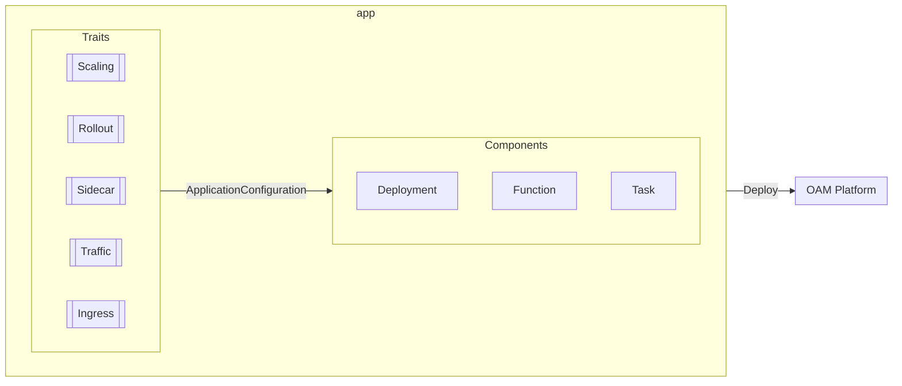

# Overview

> 运维特征




## 统一用 TraitDefinition 定义 Trait


```yaml
apiVersion: core.oam.dev/v1alpha2
kind: TraitDefinition
metadata:
  name: manualscalertrait.core.oam.dev
spec:
  appliesToWorkloads:
    - containerizedworkload.core.oam.dev
  definitionRef:
    name: manualscalertrait.core.oam.dev
```