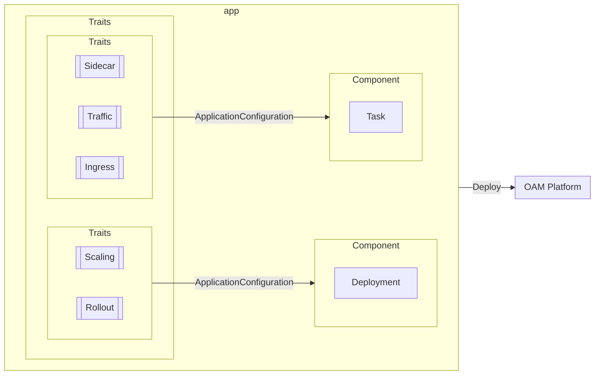

# ApplicationConfiguration

`ApplicationConfiguration` 将

- `Component`（必须）
- `Trait`（非必须）
- `Scope`（非必须）

等组合到一起形成一个完整的应用配置。

`ApplicationConfiguration`  面向应用维度绑定 `运维特征` 和 `组件`

```mermaid
flowchart LR
	classDef runtime fill:#fff,color:#fff,stroke-dasharray: 2 2;
	
	subgraph app
		direction LR
		subgraph trait[Traits]
			direction RL
			
			subgraph trait-1[Traits]
				direction RL
				Scaling-1[[Scaling]]
				Rollout-1[[Rollout]]
			end
			
			subgraph trait-2[Traits]
				direction RL
				sidecar[[Sidecar]]
				Traffic[[Traffic]]
				Ingress[[Ingress]]
			end
		end

		subgraph component-1[Component]
			Deployment
		end
		
		subgraph component-2[Component]
			Task
		end
	end
	
	subgraph platform[OAM Platform]
	end
	
	class app runtime
	trait-1 -- ApplicationConfiguration --> component-1
	trait-2 -- ApplicationConfiguration --> component-2
	
	app -- Deploy --> platform
```