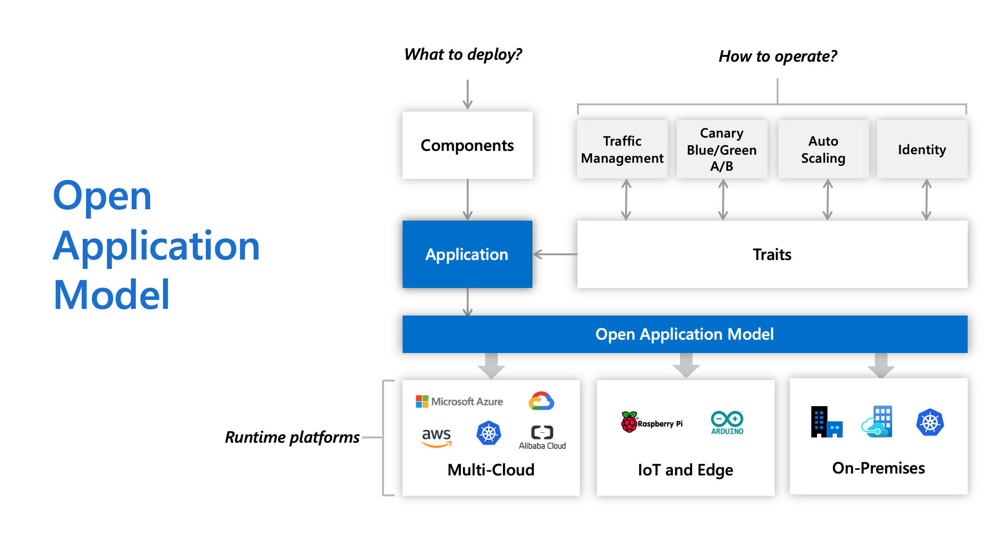
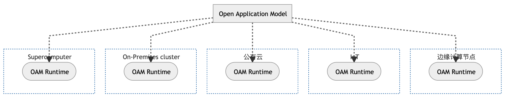

# Overview

`OAM` 是 `以应用为中心` 的上层抽象，一个用来构建云原生应用管理平台的标准规范与核心框架，规范提供了一种分层的方法来描述和部署应用程序。

`OAM` 是与平台无关、高可扩展的应用描述能力，是一个与运行时无关的模型，用于定义云本地应用程序。

尽管 `OAM` 的设计是与平台无关的，但是天生对 `Kubernetes` 平台更友好些。



- 开放（Open）：支持异构的平台、容器运行时、调度系统、云供应商、硬件配置等，总之与底层无关
- 应用（Application）：云原生应用
- 模型（Model）：定义标准，以使其与底层平台无关

## OAM 项目产生的背景

`Kubernetes` 现在已经成为了事实上的云原生分布式操作系统，其最大的优势在于扩展性，比如在计算，存储，网络都可以根据使用者的需求进行扩展。

但是也正因为太细，概念多，学习成本是非常高的，这跟 `Kubernetes` 的定位是相关的，`Kubernetes` 不是一个 `PaaS` 或者应用管理的平台，实际上它是一个标准化的能力接入层。

`Kubernetes` 它的专注点是 “如何标准化的接入来自于底层，无论是容器、虚机、负载均衡各种各样的一个能力，然后通过 `声明式 API` 的方式去暴露出来，将选择权留给了用户。

这就意味着 `Kubernetes` 实际用户不是业务研发，也不是业务运维。那是谁呢？是我们的 `平台开发者`。

### Kubernetes API 太复杂了

> 对应用开发者而言，`Kubernetes API` 针对 `简单应用` 过于复杂，针对 `复杂应用` 难以上手。

我们可以看一下一个 `简单应用` 在 `Kubernetes` 中的 `YAML` 描述清单。

<details>
	<summary>Kubernetes 资源清单</summary>

```bash
├── Chart.yaml
├── README.md
├── templates
│   ├── NOTES.txt
│   ├── _helpers.tpl
│   ├── cluster-role-binding.yaml
│   ├── configmap.yaml
│   ├── deployment.yaml
│   ├── destinationrule.yaml
│   ├── ingress-grpc.yaml
│   ├── ingress-http.yaml
│   ├── migrations-configmap.yaml
│   ├── migrations.yaml
│   ├── secrets.yaml
│   ├── service-account.yaml
│   ├── service.yaml
│   └── virtualservice.yaml
└── values.yaml
```

</details>

通过清单列表可以看到一个应用如果需要上 `Kubernetes` 平台，需要以上这么多资源，通过各种组合，应用才能够得以访问。

或许对于 `Kubernetes` 平台开发工程师来说没有任何心智负担，然而对于一个普通的应用开发者来说，这些概念太多了，根本无从下手，不禁也会产生疑问 "我只是想部署一个应用而已，非要上 `Kubernetes` 平台吗? 上 `Kubernetes` 对我的应用有什么价值呢？"

### Kubernetes 的扩展能力难以管理

> 对应用运维而言，`Kubernetes` 的扩展能力难以管理。

我们都知道 `Kubernetes` 扩展能力很强大，可以说 `CRD` + `Controllers` = `Everything`。

但是对于运维人员来说，哪些 `CRD` 有什么能力，怎么使用，相互之间会不会有冲突可以说是不够了解的。

### 结论

那以上问题怎么解决呢？

1. 人人成为 `Kubernetes` 专家（不现实）
2. 构建通用的应用管理平台（这点每家公司都有在做，都有自己的应用抽象定义，但是不标准，扩展能力差）

所以这个时候需要一个标准、开放、能力强大、无限扩展的胶水层，这个就是 `OAM`，它是可以提供无限可能的开放的平台。

## OAM 解决了什么痛点

`Kubernetes` 是没有应用的概念，它提供的是更细粒度的 “工作负载”，所以对于应用开发者来说，需要自行组合出一个应用。

对于业务研发人员和运维人员而言，他们并不想配置这些如此底层的资源信息，而希望有更高维度的抽象。

这就要求一个真正面向最终用户侧的应用定义，一个能够为业务研发和应用运维人员提供各自所需的应用定义原语。

`OAM` 加持下的 `Kubernetes` 应用拼图，可以像乐高积木一样灵活组装底层能力、运维特征以及开发组件。

`OAM` 综合考虑了在公有云、私有云以及边缘云上应用交付的解决方案，提出了通用的模型，让各平台可以在统一的高层抽象上透出应用部署和运维能力，解决跨平台的应用交付问题。

同时，`OAM` 以标准化的方式沟通和连接应用开发者、运维人员、应用基础设施，让云原生应用交付和管理流程更加连贯、一致。

`OAM` 专注于应用程序，而不是容器或协调器，它带来了模块化、可扩展和可移植的设计，用于使用一致的更高级别API对应用程序部署建模。这是在Kubernetes、云甚至IoT设备等混合环境中实现简单而健壮的应用程序交付工作流的关键。

## OAM 到底是什么

> 面向用户，以应用为中心

`OAM` 是一个 `Kubernetes` 原生的标准的 “应用定义”项目，同时也是一个专注于封装、组织和管理 `Kubernetes` 中各种“运维能力”、以及连接“运维能力”与“应用”的平台层框架。

在具体设计上，`OAM` 的描述模型是基于 `Kubernetes API` 的资源模型（Kubernetes Resource Model）来构建的，它强调一个现代应用是多个资源的集合，而非一个简单工作负载。

从 `应用` 和 `应用配置` 两个维度，为平台构建者提供了一个基于 `Kubernetes` 定义应用层抽象的标准化规范。

通过 `OAM` 构建的 `以应用为中心`、用户友好化的 `Kubernetes PaaS` 平台，充分发挥 `OAM` 的标准化与可扩展性。

实现 `OAM` 核心 `Controller` 的同时，快速接入了已有的 `Operator` 能力，通过 `OAM` 横向打通多个模块，破除了原有 `Operator` 彼此孤立、无法复用的窘境。

***设计目标***

1. `OAM` 的第一个设计目标就是补充 `应用` 这一概念，建立对应用和它所需的运维能力定义与描述的标准规范。
2. `OAM` 的第二个设计目标就是提供更高层级的应用层抽象和以应关注点分离的定义模型(基础架构与开发者的分离)。

## OAM 设计原则

- 关注点分离：根据功能和行为来定义模型，以此划分不同角色的职责，
- 平台中立：OAM 的实现不绑定到特定平台；
- 优雅：尽量减少设计复杂性；
- 复用性：可移植性好，同一个应用程序可以在不同的平台上不加改动地执行；
- 不作为编程模型：OAM 提供的是应用程序模型，描述了应用程序的组成和组件的拓扑结构，而不关注应用程序的具体实现。

## OAM 主要有三个特点

### 1. 开发和运维关注点分离

应用开发者关注业务逻辑，运维人员关注运维能力，让不同角色更专注于领域知识和能力

| 模块      | 关注对象   | 职责                                   |
| --------- | ---------- | -------------------------------------- |
| Workload  | 平台提供方 | 提供不同的 `Workload` 类型供开发者使用 |
| Component | 应用开发者 | 负责应用组件 `Component` 的定义        |
| Trait     | 基础设施运维 | 提供不同的运维能力                   |

以下理想状态的角色分类

#### 应用开发

关注应用代码开发和运行配置，是应用代码的领域专家，应用开发完成后打包（比如镜像）交给应用运维；

#### 应用运维

关注配置和运行应用实例的生命周期，比如灰度发布、监控、报警等操作，是应用运维专家；

#### 平台运维

关注应用运行平台的能力和稳定性，是底层（比如 Kubernetes 运维/优化，OS 等）的领域专家。

### 2. 平台无关、运行时无关与高可扩展

应用定义与平台实现解耦，应用描述支持跨平台实现和可扩展性

#### 平台无关性

`OAM` 应用定义并不限定你底层的平台和实际运行时，你完全可以运行在 `Kubernetes` 以外的平台，也不存在厂商锁定的问题。只要描述统一的应用配置，便可以在不同的环境达到一致的应用体验，即应用定义与平台实现解耦。

实际上 `OAM` 可以实现到任意平台或运行环境之上，这当然也包括边缘计算与物联网的场景。



<details>
    <summary>mermaid code</summary>

```
graph TD
    classDef runtime fill:#fff,stroke-dasharray: 2 2;
    OAM[Open Application Model]

    subgraph edge-platform [边缘计算节点]
    edge([OAM Runtime])
    end

    subgraph IoT-platform [IoT]
    IoT([OAM Runtime])
    end

    subgraph cloud-provider [公有云]
    public-cloud([OAM Runtime])
    end

    subgraph on-prem-cluster [On-Premises cluster]
    on-prem([OAM Runtime])
    end

    subgraph sc [Supercomputer]
    supercomputer([OAM Runtime])
    end

    OAM -.-> edge & IoT & public-cloud & on-prem & supercomputer
    class edge-platform,IoT-platform,on-prem-cluster,cloud-provider,sc runtime
```

</details>

#### 高可扩展

`OAM` 的 specification （OAM 规范） 在设计上天然是可扩展的。

`OAM` 使平台层可以通过应用特征系统 （Trait system）来体现平台的特性和差异性，也就是说，只要不同的平台都能够提供应用所需要的某些应用特征 (Trait)，开发人员就能轻松地研发跨平台的应用。

哪怕最底层的硬件提供商，也可以通过应用特征系统来体现其平台特性。

### 3. 模块化应用部署和运维特征

应用部署和运维能力可以描述成高层抽象模块，开发和运维可以自由组合和支持模块化实现

## 平台实现

### 原有平台改造为 OAM 模型实现需要做什么？

对于原先是 K8s 上的应用管理平台，接入改造为 OAM 实现可以分为两个阶段

1. 实现 OAM ApplicationConfiguration Controller（简称AppConfig Controller），这个 Controller 同时包含 OAM 的 Component、WorkloadDefinition、TraitDefinition、ScopeDefinition 等 CRD。AppConfig Controller 根据 OAM AppConfig中的描述，拉起原有平台的 CRD Operator
2. 逐渐将原先的 `CRD Operator`  根据关注点分离的思想，分为 Workload 和 Trait。同时接入和复用 OAM 社区中更多的Workload、Trait，丰富更多场景下的功能。

### 现有的 CRD Operator 为接入 OAM 需要做什么改变？

现有的 **CRD Operator** 功能上可以平滑接入 OAM 体系，比如作为一个独立扩展 Workload 接入。

但是为了更好的让终端用户体会到 OAM 关注点分离的好处，我们强烈建议 CRD Operator 根据研发和运维不同的关注点分离为不同的 CRD。

- 研发关注的 CRD 作为 Workload 接入 OAM
- 运维关注的 CRD 作为 Trait 接入 OAM。

## References

***参考资料***

- [OAM 系列文章](https://github.com/cloudnativeto/sig-oam/blob/main/docs/articles.md)
- [OAM 系列视频](https://github.com/cloudnativeto/sig-oam/blob/main/docs/video.md)
- [一些 PDF 资料](./99-assets/pdf/)
- [如何在 20 分钟内给你的 K8s PaaS 上线一个新功能](https://github.com/oam-dev/kubevela.io/blob/main/i18n/zh/docusaurus-plugin-content-blog/2020-12-14-extend-kubevela-by-cuelang-in-20-mins.md)
- [OAM 中文社区会议文档](https://shimo.im/docs/w8CgdyYGWjtYJ3XP)

***OAM 实现***

- [The Modern Application Delivery Platform(KubeVela)](https://github.com/oam-dev/kubevela/)
- [Amazon ECS for Open Application Model(AWS 探索 OAM 落地 POC 项目)](https://github.com/awslabs/amazon-ecs-for-open-application-model)
- [Rudr (Deprecated)](https://github.com/oam-dev/rudr/blob/master/README-old.md)
- [OAM Kubernetes Runtime (Deprecated)](https://github.com/crossplane/oam-kubernetes-runtime)