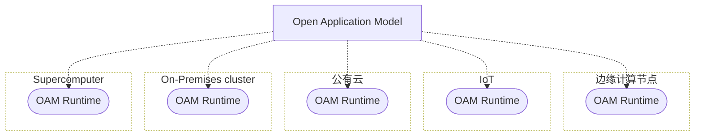

[TOC]

# Overview

`OAM` 是 “以应用为中心” 的上层抽象，一个用来构建云原生应用管理平台的标准规范与核心框架。

尽管 `OAM` 的设计是与平台无关的，但是天生对 `Kubernetes` 平台更友好些。



## OAM 项目产生的背景

`Kubernetes` 现在已经成为了事实上的云原生分布式操作系统，其最大的优势在于扩展性，比如在计算，存储，网络都可以根据使用者的需求进行扩展。

但是也正因为太细，概念多，学习成本是非常高的，这跟 `Kubernetes` 的定位是相关的，`Kubernetes` 不是一个 `PaaS` 或者应用管理的平台，实际上它是一个标准化的能力接入层。

`Kubernetes` 它的专注点是 “如何标准化的接入来自于底层，无论是容器、虚机、负载均衡各种各样的一个能力，然后通过声明式 API 的方式去暴露出来，将选择权留给了用户。

这就意味着 `Kubernetes` 实际用户不是业务研发，也不是业务运维。那是谁呢？是我们的 `平台开发者`。

### Kubernetes API 太复杂了

> 对应用开发者而言，`Kubernetes API` 针对 `简单应用` 过于复杂，针对 `复杂应用` 难以上手。

我们可以看一下一个 `简单应用` 在 `Kubernetes` 中的 `YAML` 描述清单。

<details>
	<summary>Kubernetes 资源清单</summary>

```bash
├── Chart.yaml
├── README.md
├── templates
│   ├── NOTES.txt
│   ├── _helpers.tpl
│   ├── cluster-role-binding.yaml
│   ├── configmap.yaml
│   ├── deployment.yaml
│   ├── destinationrule.yaml
│   ├── ingress-grpc.yaml
│   ├── ingress-http.yaml
│   ├── migrations-configmap.yaml
│   ├── migrations.yaml
│   ├── secrets.yaml
│   ├── service-account.yaml
│   ├── service.yaml
│   └── virtualservice.yaml
└── values.yaml
```

</details>

通过清单列表可以看到一个应用如果需要上 `Kubernetes` 平台，需要以上这么多资源，通过各种组合，应用才能够得以访问。

或许对于 `Kubernetes` 平台开发工程师来说没有任何心智负担，然而对于一个普通的应用开发者来说，这些概念太多了，根本无从下手，不禁也会产生疑问 "我只是想部署一个应用而已，非要上 `Kubernetes` 平台吗? 上 `Kubernetes` 对我的应用有什么价值呢？"

### Kubernetes 的扩展能力难以管理

> 对应用运维而言，`Kubernetes` 的扩展能力难以管理。

我们都知道 `Kubernetes` 扩展能力很强大，可以说 `CRD` + `Controllers` = `Everything`。 但是对于运维人员来说，哪些 `CRD` 有什么能力，怎么使用，相互之间会不会有冲突可以说是不够了解的。

### 总结

那以上问题怎么解决呢？

1. 人人成为 `Kubernetes` 专家（不现实）
2. 构建通用的应用管理平台（这点每家公司都有在做，都有自己的应用抽象定义，但是不标准，扩展能力差）

所以这个时候需要一个标准、开放、能力强大、无限扩展的胶水层，这个就是 `OAM`，它是可以提供无限可能的开放的平台。

## OAM 解决了什么痛点

`Kubernetes` 是没有应用的概念，它提供的是更细粒度的 “工作负载”，所以对于应用开发者来说，需要自行组合出一个应用。

对于业务研发人员和运维人员而言，他们并不想配置这些如此底层的资源信息，而希望有更高维度的抽象。

这就要求一个真正面向最终用户侧的应用定义，一个能够为业务研发和应用运维人员提供各自所需的应用定义原语。

`OAM` 加持下的 `Kubernetes` 应用拼图，可以像乐高积木一样灵活组装底层能力、运维特征以及开发组件。

## OAM 到底是什么

> 面向用户，以应用为中心

`OAM` 是一个 `Kubernetes` 原生的标准的 “应用定义”项目，同时也是一个专注于封装、组织和管理 `Kubernetes` 中各种“运维能力”、以及连接“运维能力”与“应用”的平台层框架。

在具体设计上，`OAM` 的描述模型是基于 `Kubernetes API` 的资源模型（Kubernetes Resource Model）来构建的，它强调一个现代应用是多个资源的集合，而非一个简单工作负载。

从 `应用` 和 `应用配置` 两个维度，为平台构建者提供了一个基于 `Kubernetes` 定义应用层抽象的标准化规范。

通过 `OAM` 构建的 `以应用为中心`、用户友好化的 `Kubernetes PaaS` 平台，充分发挥 `OAM` 的标准化与可扩展性。

实现 `OAM` 核心 `Controller` 的同时，快速接入了已有的 `Operator` 能力，通过 `OAM` 横向打通多个模块，破除了原有 `Operator` 彼此孤立、无法复用的窘境。

**设计目标**

1. `OAM` 的第一个设计目标就是补充 `应用` 这一概念，建立对应用和它所需的运维能力定义与描述的标准规范。
2. `OAM` 的第二个设计目标就是提供更高层级的应用层抽象和以应关注点分离的定义模型(基础架构与开发者的分离)。

## References

- [OAM 系列文章](https://github.com/cloudnativeto/sig-oam/blob/main/docs/articles.md)
- [OAM 系列视频](https://github.com/cloudnativeto/sig-oam/blob/main/docs/video.md)